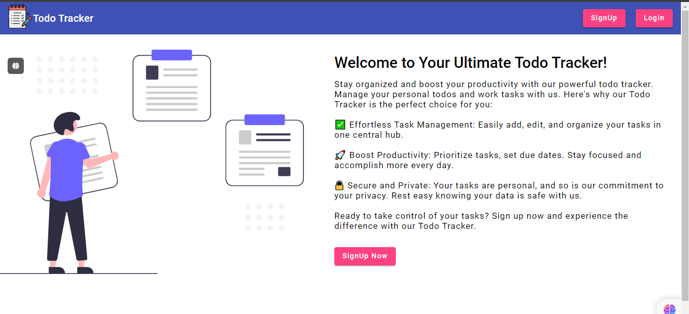
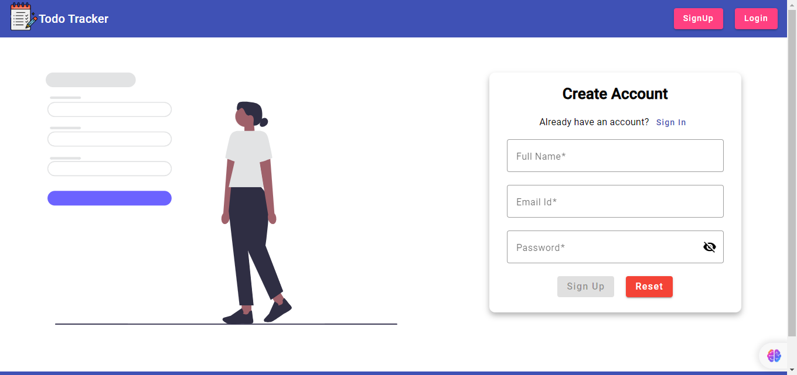
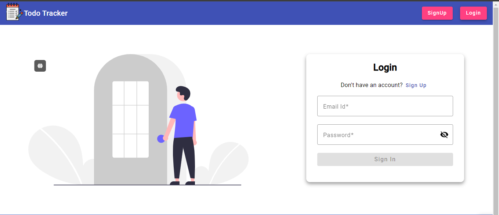
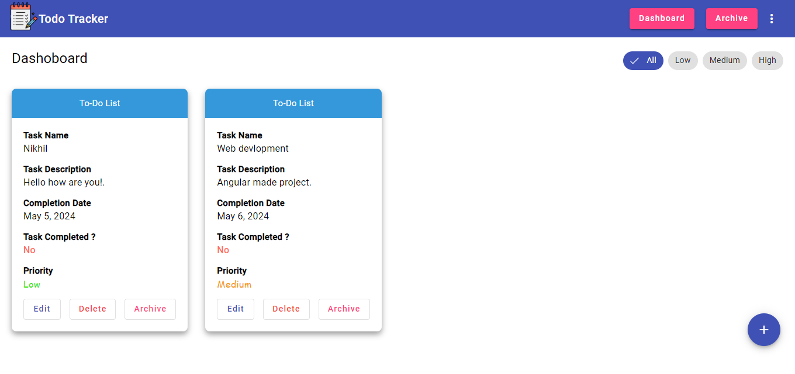
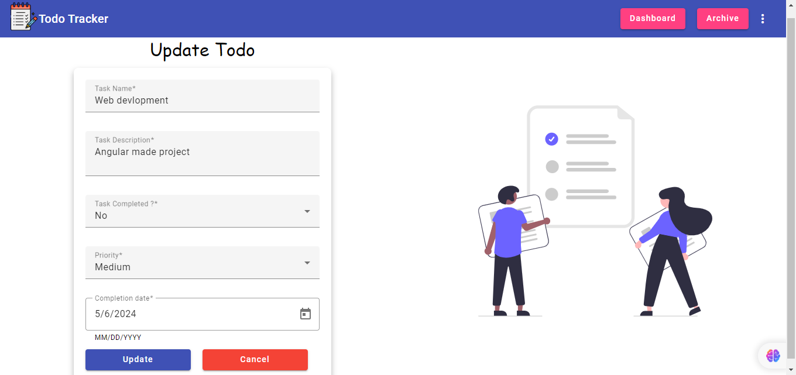
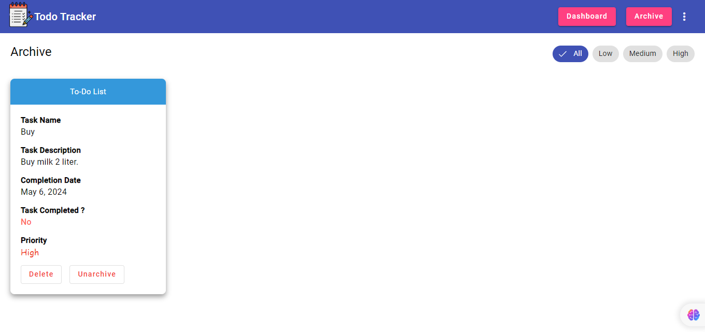
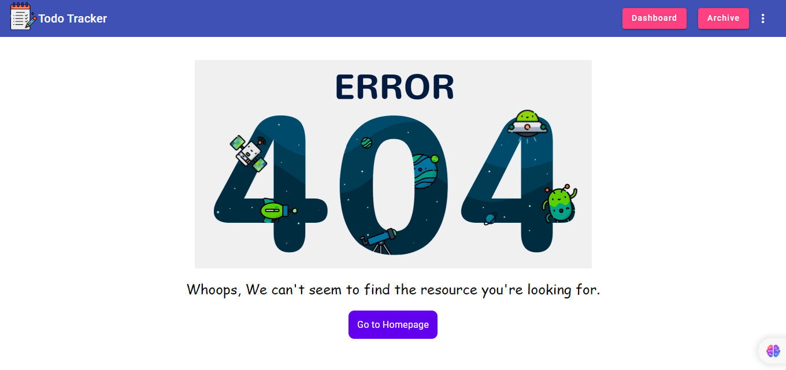
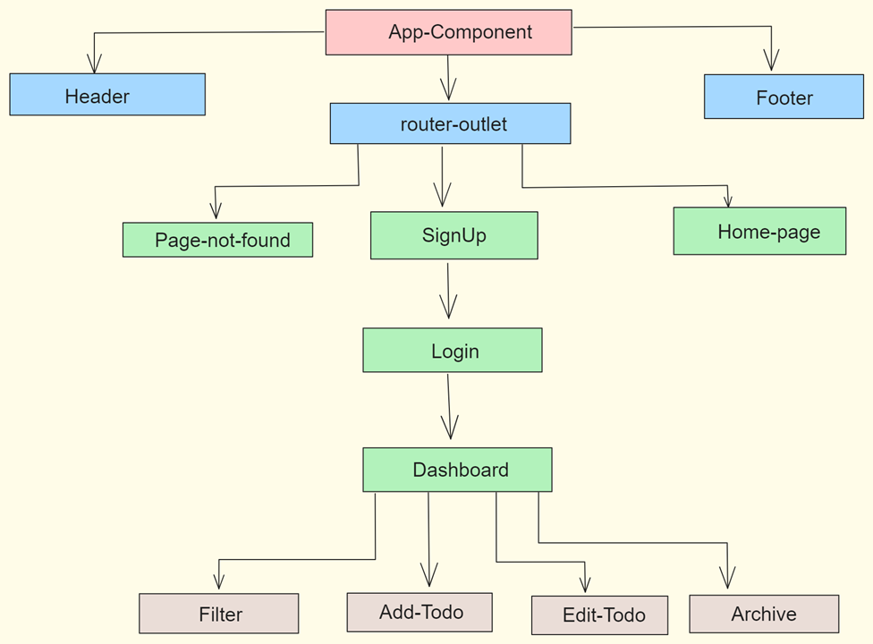
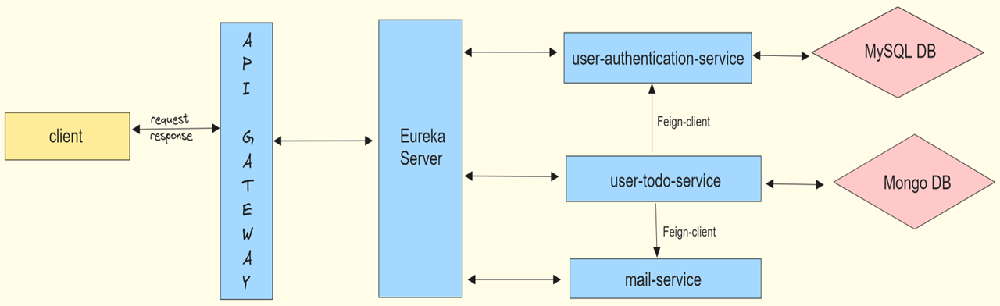

## ⭐Full Stack Todo Tracker Application using Angular and Spring Boot⭐

 

Developed a full-stack todo tracker application using Microservices, API Gateway, Eureka Server and Feign Client with
user authentication and CRUD operations.
  
Technology used: Spring Boot, Angular, HTML, CSS, Angular Material, MySQL, MongoDB

This project was part of my full-stack software engineering program at NIIT Institute.

## 📌 Features:

- #### Easily sign in, register or logout to access your personalized task management.
- #### Add, update, and delete tasks effortlessly.
- #### Users can archive or unarchive tasks.
- #### Modern and visually appealing interface for a delightful user experience.
- #### Made Responsive across all devices.

## 📌 Screenshot:

## 📌 Front-end Flow Diagram:

## 📌 Back-end Flow Diagram:

